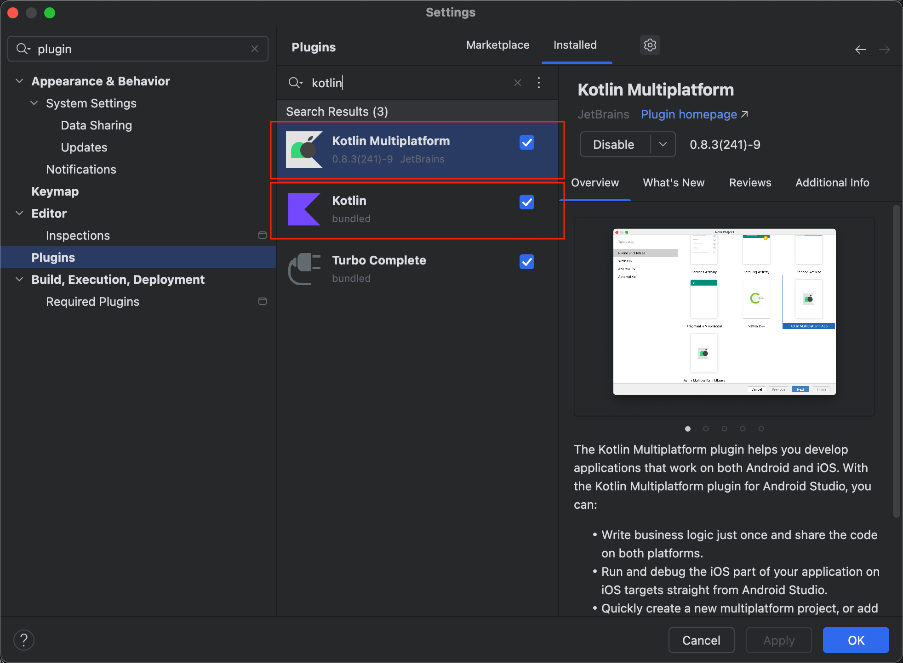
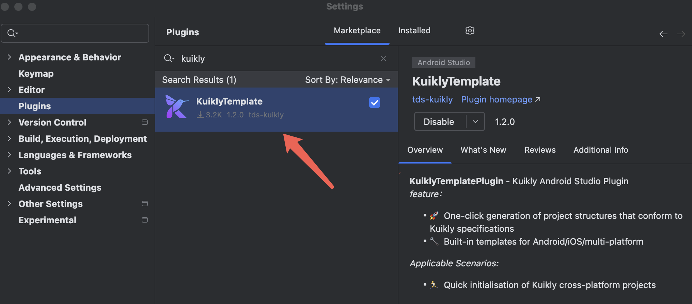
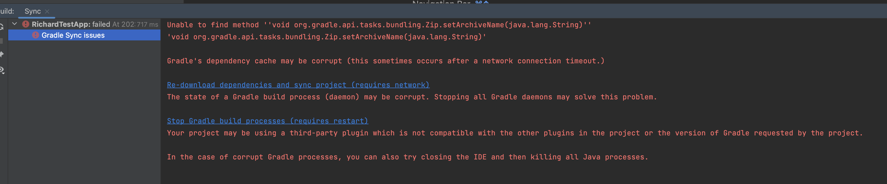
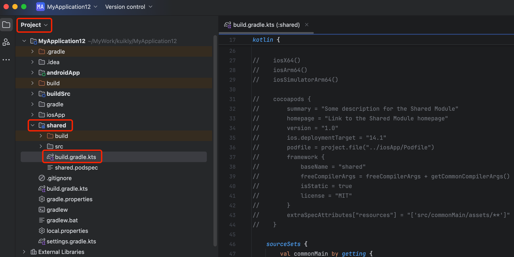
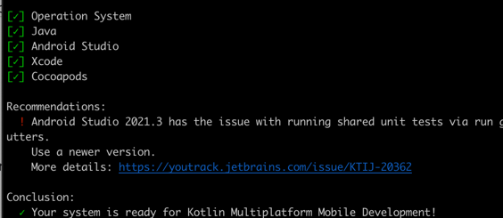

# 环境搭建

``Kuikly``是基于``Kotlin MultiPlatform(KMP)``实现的一套跨平台应用框架，因此开发环境与``KMP``要求的环境一致, 环境安装步骤如下:

1. 下载并安装[Android Studio](https://developer.android.com/studio?hl=zh-cn)

    如果你的 Android Studio 版本大于等于 (2024.2.1)，请将 Gradle JDK 版本切换为 JDK17
    (该版本默认 Gradle JDK 为 21，与项目使用的配置不兼容）

    切换方式: Android Studio -> Settings -> Build,Execution,Deployment -> Build Tools -> Gradle -> Gradle JDK
2. 在``Android Studio``中安装``Kotlin``和``Kotlin MultiPlatform``插件，路径为**Setting->Preferences->Plugins->Marketplace**
   
3. 在``Android Studio``中安装``Kuikly``插件

   安装步骤：
   
   1. Android Studio -> Setting->Preferences -> Plugins->Marketplace
   2. 在Marketplace页签，输入Kuikly回车搜索，点击Install，然后Restart IDE即可

   <div align="center">
      
   </div>

注：若想通过插件生成Ohos工程，请更新插件至1.1.0版本以上。
   
   目前``Kuikly`` Android Studio插件提供了以下功能

   1. 新建``Kuikly``业务工程: 一键生成``Kuikly``业务工程与 `Android/iOS/Ohos App` 宿主工程，自动集成``Kuikly``依赖等
   2. 新建``Kuikly``的ComposeView类: 自动帮业务开发者生成组合组件的模板代码
   3. 新建``Kuikly``的Pager类: 自动帮业务开发者生成Pager的模板代码

4. 下载``jdk 17``并配置环境变量
5. 如需运行iOS, 还需要安装[XCode](https://developer.apple.com/xcode/)和[cocoapods](https://cocoapods.org/)
6. 如需运行Ohos，还需要安装[DevEco](https://developer.huawei.com/consumer/cn/deveco-studio/)


## Gradle安装依赖失败

   如果遇到Gradle版本不匹配情况，请将Gradle版本切换成**7.x**(推荐**7.5.1**)。
   切换方式：File -> Project Structure -> Project -> Gradle Version
   
   如果Gradle版本低于7.4.1会出现报错，需要在根目录 setting.gradle.kts 添加 `enableFeaturePreview("VERSION_CATALOGS")`


## 忽略iOS编译打包

:::tip 注意
这一步为本机不安装iOS运行环境时做的兼容处理，非必需执行。
:::
若无需运行iOS，可进行如下配置忽略iOS编译打包，否则可能导致编译失败。

对于windows开发人员，系统不能运行iOS开发环境，也需要进行如下配置。

切换到Project视图，打开shared/build.gradle.kts，并注释iOS相关配置。



需要注释的配置如下：
```kotlin
plugins {
   kotlin("native.cocoapods")
}
...
kotlin { 
   ...
   iosX64()
   iosArm64()
   iosSimulatorArm64()

   cocoapods {
      summary = "Some description for the Shared Module"
      homepage = "Link to the Shared Module homepage"
      version = "1.0"
      ios.deploymentTarget = "14.1"
      podfile = project.file("../iosApp/Podfile")
      framework {
         baseName = "shared"
         isStatic = true
         license = "MIT"
      }
   }
   ...
   val iosX64Main by getting
   val iosArm64Main by getting
   val iosSimulatorArm64Main by getting
   val iosMain by creating {
      dependsOn(commonMain)
      iosX64Main.dependsOn(this)
      iosArm64Main.dependsOn(this)
      iosSimulatorArm64Main.dependsOn(this)
   }
   val iosX64Test by getting
   val iosArm64Test by getting
   val iosSimulatorArm64Test by getting
   val iosTest by creating {
      dependsOn(commonTest)
      iosX64Test.dependsOn(this)
      iosArm64Test.dependsOn(this)
      iosSimulatorArm64Test.dependsOn(this)
   }
}
...
dependencies {
   ...
   add("kspIosArm64", this)
   add("kspIosX64", this)
   add("kspIosSimulatorArm64", this)
}
```

## 使用KMP提供的KDoctor检查环境(仅限Mac用户)

:::tip 注意
这一步为检查本地的环境是否满足KMP的环境要求，非必需执行。
:::

1. 安装**kdoctor**: ``brew install kdoctor``
2. 安装完毕后，命令行输入``kdoctor``, 检查环境是否准备好



## 更多

关于``KMP``环境搭建遇到的问题，可以到[KMP官网](https://www.jetbrains.com/help/kotlin-multiplatform-dev/multiplatform-setup.html#check-your-environment)
查看更详细的环境搭建教程