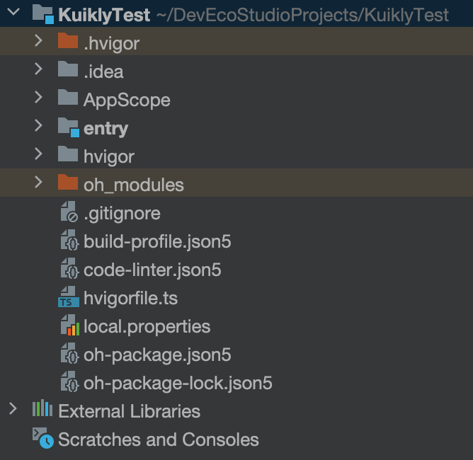
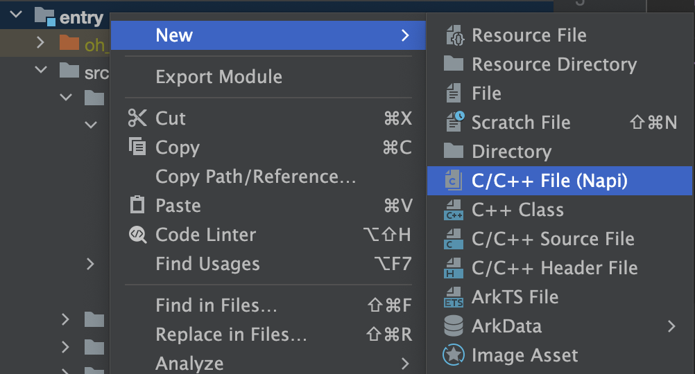
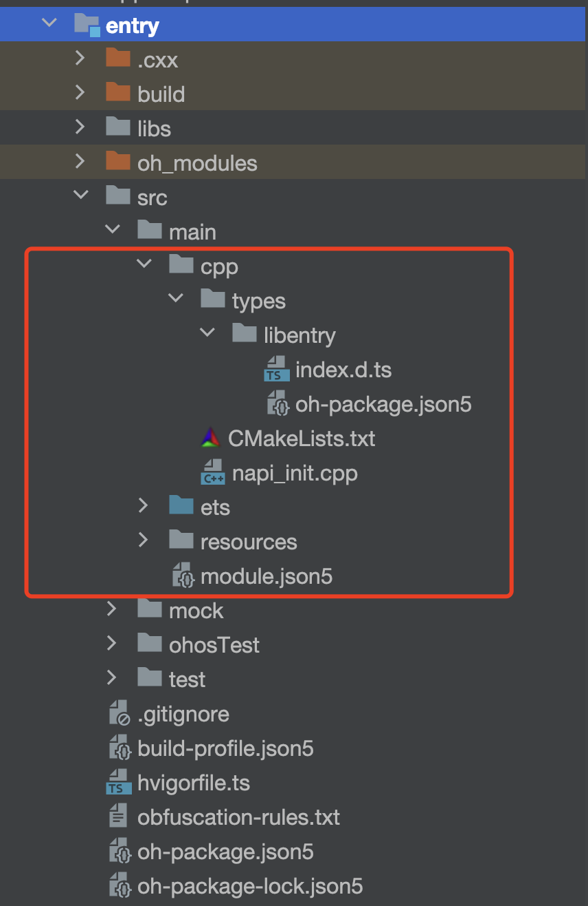
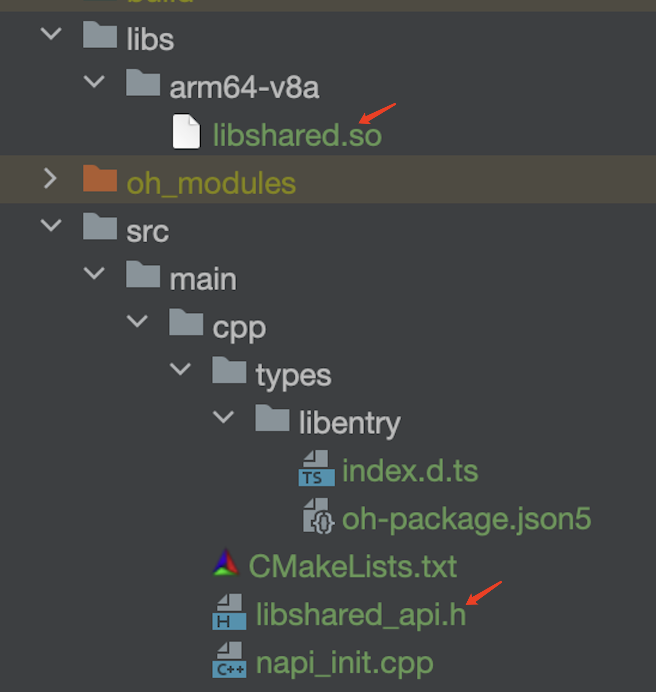
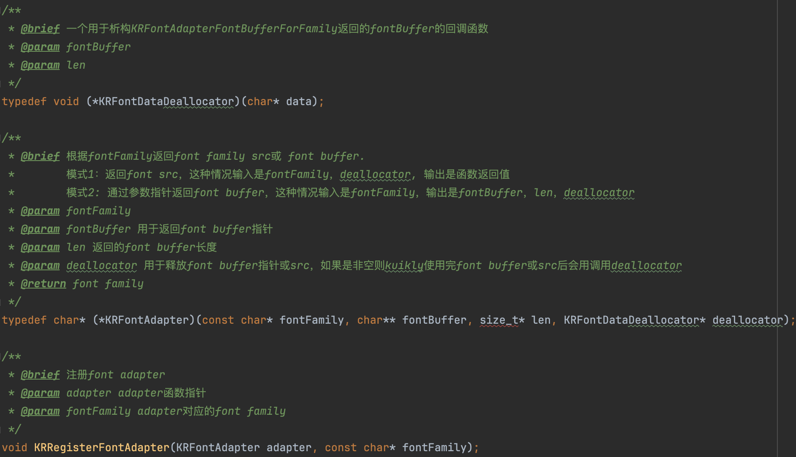

# 鸿蒙工程接入

:::tip 注意
在此之前请确保已经完成**KMP侧 Kuikly**的接入，如还未完成，请移步[Kuikly KMP侧接入](./common.md)
:::

完成**Kuikly KMP**侧的配置后, 我们还需要将**Kuikly**渲染器和适配器接入到宿主平台中，此文档适用于您想把Kuikly渲染器接入到您现有的鸿蒙工程中。下面我们来看下，如何在现有鸿蒙工程中接入Kuikl渲染器。

我们用鸿蒙开发IDE DevEco Studio新建一个名为**KuiklyTest**的新工程并假设这个工程是你现有的鸿蒙工程:

<div align="center">

</div>

## 添加Kuikly渲染器依赖

编辑entry模块的oh-package.json5，添加 Kuikly 相关 dependencies 依赖项：

```json
// entry/oh-package.json5
{
  ...
  "dependencies": {
    ...
    "@kuikly-open/render": 'KUIKLY_RENDER_VERSION'
  }
}
```
:::tip 提示
* KUIKLY_RENDER_VERSION 需要替换为实际的 kuikly 版本号，在这里[查看最新版本](../ChangeLog/changelog.md)
* 版本号需要和[KMP跨端工程](common.md)保持一致
:::
点击右上角【Sync Now】（或者在entry目录下命令行执行ohpm install）。

## 创建鸿蒙运行时初始化接口
Kuikly 鸿蒙端渲染是基于ArkUI C-API 实现，在业务接入时，需要通过 NAPI ，将运行时初始化接口暴露到业务ArkTS层。
### 添加C++（NAPI）支持
在鸿蒙工程的 entry 入口模块添加C++（NAPI）支持（以前加过的跳过）。右键点击 entry 目录，在弹出的菜单中做如下选择：
<div>

</div>
确认创建后，会在 entry 目录新增 C++代码目录，如下图：
<div>

</div>

### 添加 NAPI 初始化入口函数
在上述C++目录下的**napi_init.cpp**文件，添加**InitKuikly**初始化入口，并暴露给ArkTS。具体实现代码，请参考源码工程 core-render-ohos/entry 模块的**napi_init.cpp**类。
```c++
// entry/src/main/cpp/napi_init.cpp
#include "napi/native_api.h"

static napi_value InitKuikly(napi_env env, napi_callback_info info) {
    //  添加业务代码初始化逻辑。具体见后续步骤说明
    return nullptr;
}

EXTERN_C_START
static napi_value Init(napi_env env, napi_value exports)
{
    napi_property_descriptor desc[] = {
        // 导出 initKuikly，使其可以被ArkTS层访问和调用
        {"initKuikly", nullptr, InitKuikly, nullptr, nullptr, nullptr, napi_default, nullptr},
    };
    napi_define_properties(env, exports, sizeof(desc) / sizeof(desc[0]), desc);
    return exports;
}
EXTERN_C_END

static napi_module demoModule = {
    .nm_version = 1,
    .nm_flags = 0,
    .nm_filename = nullptr,
    .nm_register_func = Init,
    .nm_modname = "entry",
    .nm_priv = ((void*)0),
    .reserved = { 0 },
};

extern "C" __attribute__((constructor)) void RegisterEntryModule(void)
{
    napi_module_register(&demoModule);
}
```
在C++目录下的**index.d.ts**文件，对**initKuikly**进行接口声明
```ts
// entry/src/main/cpp/types/libentry/index.d.ts
export const initKuikly: () => number;
```

### 关联NativeManager
在**entry/src/main/ets**下创建**kuikly**目录。
<br>**kuikly**目录下，创建**MyNativeManager.ets**类，实现**KuiklyNativeManager**类的**loadNative**接口，将Kuikly运行时初始化入口与框架KuiklyNativeManager关联。
<br>请参考源码工程 core-render-ohos/entry 模块的**MyNativeManager.ets**类。
```ts
// entry/src/main/ets/kuikly/MyNativeManager.ets
import { KuiklyNativeManager } from '@kuikly-open/render';
import Napi from 'libentry.so';

class MyNativeManager extends KuiklyNativeManager {
  protected loadNative(): number {
    // 调用Napi接口，初始化 Kuikly Native
    return Napi.initKuikly();
  }
}

// 导出一个全局的 KuiklyNativeManager 实例给 Kuikly 页面共用
const globalNativeManager = new MyNativeManager();

export default globalNativeManager;
```

## 实现Kuikly承载容器
### 创建委托类
**kuikly**目录下，创建**IKuiklyViewDelegate**委托者实现类**KuiklyViewDelegate.ets**，用于向框架注册自定义View和Module、框架感知页面生命周期等。
<br>请参考源码工程 core-render-ohos/entry 模块的**KuiklyViewDelegate.ets**类，注入自定义 View 和 Module。
```ts
// entry/src/main/ets/kuikly/KuiklyViewDelegate.ets
import { IKuiklyViewDelegate, KRRenderModuleExportCreator, KRRenderViewExportCreator } from '@kuikly-open/render';

export class KuiklyViewDelegate extends IKuiklyViewDelegate {
  getCustomRenderViewCreatorRegisterMap(): Map<string, KRRenderViewExportCreator> {
    const map: Map<string, KRRenderViewExportCreator> = new Map();
    return map;
  }

  getCustomRenderModuleCreatorRegisterMap(): Map<string, KRRenderModuleExportCreator> {
    const map: Map<string, KRRenderModuleExportCreator> = new Map();
    return map;
  }
}
```
### 实现Kuikly承载容器
在page页面容器中加入Kuikly组件（以 pages/Index 为例，也可以是新建的page），触发Kuikly页面加载。
<br>请参考源码工程 core-render-ohos/entry 模块的**Index.ets**类。
```ts
// entry/src/main/ets/kuikly/pages/Index.ets
import { KRRecord, KRNativeRenderController, Kuikly } from '@kuikly-open/render';
import globalNativeManager from '../kuikly/MyNativeManager';
import { KuiklyViewDelegate } from '../kuikly/KuiklyViewDelegate';
import router from '@ohos.router';
import { hilog } from '@kit.PerformanceAnalysisKit';
import { ContextCodeHandler } from '../kuikly/ContextCodeHandler';

@Entry
@Component
struct Index {
  private kuiklyViewDelegate = new KuiklyViewDelegate();
  private kuiklyController : KRNativeRenderController | null = null

  private pageName: string | null = null;
  private pageData?: KRRecord;
  private contextCode: string = '';
  private contextCodeHandler: ContextCodeHandler = new ContextCodeHandler();
  private useDefaultBackPress = true
  @State showKuikly: boolean = false;

  onBackPress(): boolean | void {
    if(this.useDefaultBackPress){
      return
    }

    if(this.kuiklyViewDelegate){
      this.kuiklyController?.sendBackPressEvent()
      return true
    }
  }

  aboutToAppear(): void {
    const params = router.getParams() as Record<string, Object>;
    this.pageName = params?.pageName as string;
    this.pageData = (params?.pageData as KRRecord | null) ?? {}
    if (this.contextCodeHandler.isNeedGetContextCode(params)) {
      this.contextCodeHandler.handleGetContextCode(getContext(), params, (contextCode) => {
        this.contextCode = contextCode;
        this.showKuikly = true;
      }, (stack) => {
        this.showExceptionDialog(stack);
      })
    } else {
      this.showKuikly = true;
    }
  }

  build() {
    Stack() {
      if (this.showKuikly) {
        Kuikly({
          pageName: this.pageName ?? 'router',
          pageData: this.pageData ?? {},
          delegate: this.kuiklyViewDelegate,
          contextCode: this.contextCode,
          executeMode: this.contextCodeHandler.getExecuteMode(this.contextCode),
          onControllerReadyCallback: (controller) => {
            this.kuiklyController = controller
            controller.registerExceptionCallback((executeMode, stack) => {
              this.showExceptionDialog(stack);
              const stackInfo:KRRecord = JSON.parse(stack)
              stackInfo['stack'].toString().split('\n').forEach((it)=>{
                hilog.error(0x0000, 'demo', '%{public}s', it);
              })
            });
          },
          nativeManager: globalNativeManager,
        })
      }
    }.expandSafeArea([SafeAreaType.KEYBOARD])
    // .backgroundColor(Color.Green)
  }

  private showExceptionDialog(stack: string) {
    // 对话框显示异常堆栈
  }

  onPageShow(): void {
    const res = getContext(this).resourceDir
    this.kuiklyViewDelegate.pageDidAppear()
  }

  onPageHide(): void {
    this.kuiklyViewDelegate.pageDidDisappear()
  }
}
```
```ts
// entry/src/main/ets/kuikly/pages/ContextCodeHandler.ets
import { KRRenderExecuteModeBase, KRRenderNativeMode } from '@kuikly-open/render';

export class ContextCodeHandler {
  isNeedGetContextCode(params: Record<string, Object>) {
    return false
  }

  handleGetContextCode(context: Context, params: Record<string, Object>, callback: (contextCodeParam: string) => void,
  exceptionCallback: (stack: string) => void) {

  }

  getExecuteMode(contextCode: string): KRRenderExecuteModeBase {
    return KRRenderNativeMode.Native
  }
}
```

## 实现适配器（必须实现部分）
``Kuikly``框架为了灵活和可拓展性，不会内置实现异常处理，日志实现等功能，而是通过适配器的设计模式，将具体实现委托给宿主App实现。

``Kuikly``为鸿蒙端宿主工程提供了以下适配器, 需宿主平台按需实现

### 日志适配器示例
请参考源码工程 core-render-ohos/entry 模块的**AppKRLogAdapter.ets**类。
```ts
// entry/src/main/ets/kuikly/adapters/AppKRLogAdapter.ets
import { IKRLogAdapter } from '@kuikly-open/render';
import { hilog } from '@kit.PerformanceAnalysisKit';

export class AppKRLogAdapter implements IKRLogAdapter {

  i(tag: string, msg: string): void {
    hilog.info(0x30, tag, '%{public}s', msg)
  }

  d(tag: string, msg: string): void {
    hilog.debug(0x30, tag, '%{public}s', msg)
  }

  e(tag: string, msg: string): void {
    hilog.error(0x30, tag, '%{public}s', msg)
  }

}
```

### 路由适配器示例
请参考源码工程 core-render-ohos/entry 模块的**AppKRRouterAdapter.ets**类。
```ts
// entry/src/main/ets/kuikly/adapters/AppKRRouterAdapter.ets
import { KRRecord } from '@kuikly-open/render';
import { IKRRouterAdapter } from '@kuikly-open/render';
import router from '@ohos.router';
import { common } from '@kit.AbilityKit';

export class AppKRRouterAdapter implements IKRRouterAdapter {

  openPage(context: common.UIAbilityContext, pageName: string, pageData: KRRecord): void {
    router.pushUrl({
      url: 'pages/Index',
      params: {
         pageName,
         pageData
      }
    })
  }

  closePage(context: common.UIAbilityContext): void {
    router.back()
  }
}
```
### 初始化适配器
在 UIAbility 的 onWindowStageCreate 时机初始化 Kuikly（多ability场景可以把初始化时机提前到AbilityStage，避免相互覆盖）：
<br>请参考源码工程 core-render-ohos/entry 模块的**EntryAbility.ets**类。
```ts
// entry/src/main/ets/entryability/EntryAbility.ets
import { KuiklyRenderAdapterManager } from '@kuikly-open/render';

export default class EntryAbility extends UIAbility {
  ...
  onWindowStageCreate(windowStage: window.WindowStage): void {
    // Main window is created, set main page for this ability
    // 日志适配器
    KuiklyRenderAdapterManager.krLogAdapter = new AppKRLogAdapter();
    // 路由适配器
    KuiklyRenderAdapterManager.krRouterAdapter = new AppKRRouterAdapter();
    ...
  }
}
```

## 链接Kuikly业务代码
Kuikly业务代码，在鸿蒙平台上会被编译成 so 产物，下面以本地so文件方式为例介绍链接Kuikly业务代码的流程。
我们先前在``Kuikly``[KMP跨端工程接入](common.md)中已经新建了``Kuikly``业务工程，然后我们将这个业务工程的业务代码编译成的``.so``链接到我们的现有鸿蒙工程。

### 生成 so 产物和头文件
鸿蒙Kuikly业务代码编译生成 so 产物，详细步骤参考[鸿蒙平台开发方式](../DevGuide/harmony-dev.md)。
<br>[KMP侧接入](common.md)工程中，编译跨端工程的``shared``模块，命令行执行 ``./gradlew -c settings.ohos.gradle.kts :shared:linkOhosArm64`` 编译鸿蒙so产物。


### 拷贝Kuikly业务代码产物
将业务代码生成的动态链接库文件libshared.so和头文件libshared_api.h拷贝到C++模块中：

<div>

</div>

### 修改CMakeList
修改C++目录下 CMakeLists.txt，导入业务产物和Kuikly SDK的动态链接库：

```cmake
set(NATIVERENDER_ROOT_PATH ${CMAKE_CURRENT_SOURCE_DIR})

# Kuikly SDK
add_library(kuikly_render SHARED IMPORTED)
set_target_properties(kuikly_render
    PROPERTIES
    IMPORTED_LOCATION ${NATIVERENDER_ROOT_PATH}/../../../oh_modules/@kuikly-open/render/libs/${OHOS_ARCH}/libkuikly.so)
# 业务产物
add_library(kuikly_shared SHARED IMPORTED)
set_target_properties(kuikly_shared
    PROPERTIES
    IMPORTED_LOCATION ${NATIVERENDER_ROOT_PATH}/../../../libs/${OHOS_ARCH}/libshared.so)
# 追加「kuikly_shared」和「kuikly_render」到入口模块target_link_libraries
target_link_libraries(entry PUBLIC libace_napi.z.so kuikly_shared kuikly_render)

```

### 实现 NAPI 初始化入口函数InitKuikly
在前述章节[添加 NAPI 初始化入口函数](harmony.md#创建鸿蒙运行时初始化接口)步骤，我们创建了**InitKuikly**初始化入口函数，我们在这个步骤实现这个函数即可。
```c++
// entry/src/main/cpp/napi_init.cpp
#include "libshared_api.h"
#include "napi/native_api.h"

static napi_value InitKuikly(napi_env env, napi_callback_info info) {
  // symbols入口名和kuikly工程的配置有关，具体查看产物的头文件
  auto api = libshared_symbols();
  int handler = api->kotlin.root.initKuikly();
  napi_value result;
  napi_create_int32(env, handler, &result);
  return result;
}
EXTERN_C_START
static napi_value Init(napi_env env, napi_value exports) {
  napi_property_descriptor desc[] = {
    {"initKuikly", nullptr, InitKuikly, nullptr, nullptr, nullptr, napi_default, nullptr},
  };
  napi_define_properties(env, exports, sizeof(desc) / sizeof(desc[0]), desc);
  return exports;
}
EXTERN_C_END

```
### 拷贝资源文件
如果有资源文件，需要把assets目录下的资源文件拷贝到entry/src/main/resources/resfile，例如：
```
shared/src/commonMain/assets/common/* -> entry/src/main/resources/resfile/common/*
```

## 编写TestPage验证

完成上述步骤后, 我们便完成了Kuikly的接入。下面我们在[KMP侧接入](common.md)工程中的``shared``模块下新建页面名为test的``TestPage``进行测试。

```kotlin
@Page("test")
class TestPage : Pager(){
    override fun body(): ViewBuilder {
        return {
            attr {
                allCenter()
            }

            Text {
                attr {
                    fontSize(18f)
                    text("Hello Kuikly")
                    color(Color.GREEN)
                }
            }
        }
    }
}
```

将``test``替换``router``作为``pageName``传入page/Index中, 指定跳转到我们刚新建的``TestPage``页面

```ts
// entry/src/main/ets/kuikly/pages/Index.ets
...
      Kuikly({
        pagerName: this.pageName ?? 'test',
        ...
      })
...
```
参考[生成 so 产物和头文件](harmony.md#生成-so-产物和头文件)、[拷贝Kuikly业务代码产物](harmony.md#拷贝kuikly业务代码产物)，在KMP工程重新生成 so 产物和头文件，更新到鸿蒙工程，编译鸿蒙应用。
当手机出现以下界面时, 说明已经成功接入Kuikly

<div align="center">

</div>


## 实现适配器（按需实现部分）
### 自定义字体适配器示例
该适配器非必须实现, 业务可根据实际使用需求来决定是否实现。

接口是KRRegisterFontAdapter，定义于Kuikly.h
<div>

</div>

**使用方法**

**1. CMakeList头文件搜索目录添加**
:::tip
若无配置，可以可以参考下一章节[链接Kuikly业务代码](harmony.md#链接kuikly业务代码)
:::

修改 entry 模块的 CMakeList.txt 添加 kuikly 头文件搜索路径
```cmake
include_directories(...
                    ${NATIVERENDER_ROOT_PATH}/../../../oh_modules/@kuikly-open/render/include)
```

**2. 头文件引入**

在调用KRRegisterFontAdapter的源文件中增加include。如在上述C++目录下的**napi_init.cpp**文件 include 如下头文件。

`#include <Kuikly/Kuikly.h>`

**3. Adapter实现**
<br>具体实现代码，请参考源码工程 core-render-ohos/entry 模块的**napi_init.cpp**类。
```c
// entry/src/main/cpp/napi_init.cpp
...
#include <Kuikly/Kuikly.h>
...
static char *MyFontAdapter(const char *fontFamily, char **fontBuffer, size_t *len, KRFontDataDeallocator *deallocator) {
    if (isEqual(fontFamily, "Satisfy-Regular")) {
        return "rawfile:Satisfy-Regular.ttf";
    }
    return (char *)customFontPath.c_str();
}
...
```

**4. Adapter注册**
可在使用Kuikly前进行adapter注册，作为示例，简单起见这里在 InitKuikly 中进行了注册，实际使用的时候可以在其他更早实际，也应该注意不要多次注册。
```c
// entry/src/main/cpp/napi_init.cpp
...
static napi_value InitKuikly(napi_env env, napi_callback_info info) {
    KRRegisterFontAdapter(MyFontAdapter, "Satisfy-Regular");
    
    // ...
 }
 ...
```

**5. 如何获得字体路径**

业务一般通过网络等途径下载字体，这种情况下可以通过adapter返回路径即可。
不过有的业务会将字体文件放到rawfile中，但目前还有没有稳定获取rawfile路径的方法，可参考demo片段把字体拷贝到临时文件目录中：

```ts
  // copy font data to tmp folder
  const content = getContext().resourceManager.getRawFileContentSync("Satisfy-Regular.ttf")
  const destPath = `${getContext().tempDir}/Satisfy-Regular.ttf`;

  fs.open(destPath, fs.OpenMode.CREATE | fs.OpenMode.READ_WRITE, (err: BusinessError, data) => {
    if (err) {
      console.error("copy file failed with error message: " + err.message + ", error code: " + err.code);
    } else {
      fs.write(data.fd, content.buffer, {offset: 0, length: content.length}).then((result)=>{
        console.info(`copy file succeed:${result}`);
        Napi.setFontPath(destPath)
      })
    }
  })
```

并通过一个setFontPath接口设置给c++侧，让adapter返回：

>此处NAPI调用设置可以参考[NAPI初始化逻辑](harmony.md#napi初始化逻辑)

```c
static std::string customFontPath;

static napi_value SetFontPath(napi_env env, napi_callback_info info) {
    if (customFontPath.size() > 0) {
        return nullptr;
    }

    size_t argc = 1;
    napi_value args[1] = {nullptr};
    napi_get_cb_info(env, info, &argc, args, nullptr, nullptr);

    size_t length = 0;
    napi_status status;
    status = napi_get_value_string_utf8(env, args[0], nullptr, 0, &length);
    std::string buffer(length, 0);
    status = napi_get_value_string_utf8(env, args[0], reinterpret_cast<char *>(buffer.data()), length + 1, &length);
    customFontPath = buffer;

    return nullptr;
}

static char *MyFontAdapter(const char *fontFamily, char **fontBuffer, size_t *len, KRFontDataDeallocator *deallocator) {
    if (isEqual(fontFamily, "Satisfy-Regular")) {
        return "rawfile:Satisfy-Regular.ttf";
    }
    return (char *)customFontPath.c_str();
}
```
