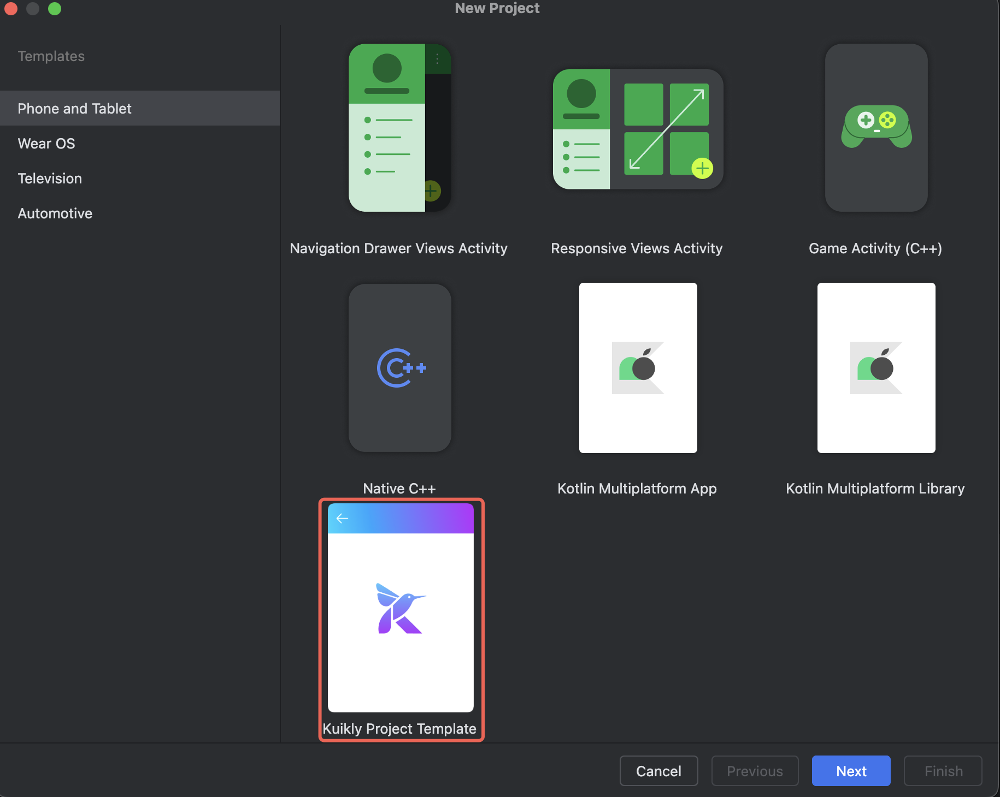

# 编写第一个Kuikly页面

:::tip 注意
在此之前请确保已经完成**Kuikly**环境搭建，如还未搭建环境，请移步[环境搭建文档](env-setup.md)
:::

## 新建Kuikly工程

1. 使用``Android Studio``新建``Kuikly``工程。 **File -> New -> New Project -> Kuikly Project Template**



## 工程自动构建
若环境搭建无误，工程将自动构建，如遇以下问题，可根据解决方案进行处理并手动触发sync：

### Gradle安装依赖失败

如果遇到Gradle版本不匹配情况，请将Gradle版本切换成7.x(如7.5.1)。  **File -> Project Structure -> Project -> Gradle Version**

如果Gradle版本低于7.4.1会出现报错，需要在根目录 setting.gradle.kts 添加 `enableFeaturePreview("VERSION_CATALOGS")`

### 找不到pod程序

参照[环境搭建文档](env-setup.md)，确保iOS运行环境安装无误或者已注释相关构建逻辑([忽略iOS编译打包](env-setup.md#忽略ios编译打包))

### 没有启动配置

工程构建完以后没有提供预设的启动配置，一般是由于之前出现异常导致的，解决异常后重新sync即可

## 运行androidApp

1. 接着运行``androidApp``


2. 当手机出现**以下页面**时，说明已经成功运行``androidApp``

<div align="center">

</div>

## 运行iosApp

1. 如果是首次运行iOS的话，需要先进入iosApp目录，执行`pod install --repo-update`。
2. 将运行的scheme改为iosApp


3. 运行``iosApp``


4. 当手机出现下面界面时，说明已运行成功

<div align="center">

</div>

:::tip 注意
插件自动创建的工程iosApp在编译时会执行KMP脚本，如果遇到脚本读写文件权限报错，需要在``Xcode -> Build Setting``中将``User Script Sandboxing``设置为``No``
:::

## 运行鸿蒙App
:::tip 注意
1. 当前kuikly鸿蒙跨端产物仅支持Mac编译，Windows可以使用编译好的跨端产物运行Ohos宿主APP 
2. 若想通过插件生成Ohos工程，需要更新插件至1.1.0版本以上

:::
1. 如果是首次运行Ohos的话，需要用鸿蒙DevEco-Studio打开ohosApp目录
    >若初次打开鸿蒙IDEsync出错，打开ohosApp目录下的.npmrc文件，右上角点击sync重新sync即可

2. 在运行之前App之前，需要执行签名操作
    File -> Project Structure -> Signing Configs
    <div align="center">
        
    </div>
3. 运行``ohosApp``

    可以选择在 DevEco-Studio 内运行 或 Android Studio 内运行

   

   
    > 若 Android Studio 无ohosApp选项 重新打开Android Studio即可
4. 当手机出现下面界面时，说明已运行成功ohosApp
    <div align="center">
        
    </div>

## 运行H5
模版工程H5正在发布审核中，如果未更新可以先使用 Github 源码体验，或者[参考文档](https://doc.weixin.qq.com/doc/w3_ANsAsgZ1ACcCNWexFbikQQFW4435m?scode=AJEAIQdfAAo3uUNcaFANsAsgZ1ACc)本地安装插件

H5 是通过 gradle 启动 dev-server 来运行

1. 编译demo代码成js
```shell
# 运行 demo 项目 dev server 服务器，没有安装 npm 包则先 npm install 安装一下依赖
npm run serve
#  构建 shared 项目 Debug 版
./gradlew :shared:packLocalJsBundleDebug
```

2. 编译h5App代码成js，然后启动调试服务
```shell
#  运行 h5App 服务器 Debug 版
./gradlew :h5App:jsBrowserRun -t
kotlin 2.0 以上运行: ./gradlew :h5App:jsBrowserDevelopmentRun -t
如果window平台因为编译iOS模块失败，可以参考"快速开始-环境搭建"指引配置
# 拷贝 assets 资源到 dev server
./gradlew :h5App:copyAssetsToWebpackDevServer
```
3. 浏览器查看效果
就可以在 http://localhost:8080/ 看到效果了，如果要访问不同的页面，可以通过 url 参数指定页面名称，如：http://localhost:8080/?page_name=router

4. 浏览器下面界面时，说明已运行成功h5App

<div align="center">
    
</div>


## 运行微信小程序
模版工程微信小程序正在发布审核中，如果未更新可以先使用 Github 源码体验，或者[参考文档](https://doc.weixin.qq.com/doc/w3_ANsAsgZ1ACcCNWexFbikQQFW4435m?scode=AJEAIQdfAAo3uUNcaFANsAsgZ1ACc)本地安装插件

微信小程序先通过 gradle 编译js，然后通过微信开发者工具来运行
1. 编译demo代码成js
```shell
# 运行 demo 项目 dev server 服务器，没有安装 npm 包则先 npm install 安装一下依赖
npm run serve
#  构建 demo 项目 Debug 版
./gradlew :shared:packLocalJsBundleDebug
```

2. 编译miniApp代码成js，然后启动调试服务
```shell
#  运行 miniApp 服务器 Debug 版
./gradlew :miniApp:jsMiniAppDevelopmentWebpack
```

构建 release 版本
```shell
# 首先构建业务 Bundle
./gradlew :demo:packLocalJSBundleRelease

# 然后构建 miniApp
./gradlew :miniApp:jsMiniAppProductionWebpack
```

3.使用微信小程序开发者工具打开miniApp下的dist目录，根据你的实际页面，修改app.json里面的pages数组和在pages里新建对应的页面

4. 微信开发者工具编译运行，出现下面界面时，说明已运行成功miniApp
    <div align="center">
        
    </div>

## 开始编写代码

我们来看如何使用``Kuikly``编写经典``HelloWorld``

1. 在**share/src/commonMain/kotlin/xxx.xxx.xxx/** 目录下新建 **pages** 目录并创建``HelloWorldPage``类
2. 接着我们让``HelloWorldPage``继承``Pager``, 并重写``body``方法

```kotlin
internal class HelloWorldPage : Pager() {

    override fun body(): ViewBuilder {
    }
}
```

3. 在``body``方法中，我们添加一个居中的Text组件

```kotlin
internal class HelloWorldPage : Pager() {

    override fun body(): ViewBuilder {
        return {
            attr {
                allCenter()
            }

            Text {
                attr {
                    text("Hello Kuikly")
                    fontSize(14f)
                }
            }
        }
    }
}
```

4. 接着我们在``HelloWorldPage``类加上``@Page``注解，指定``Page``的名字，供``Kuikly``在运行时创建该``Page``

```kotlin
@Page("HelloWorld")
internal class HelloWorldPage : Pager() {
    ...
}
```

5. 完整的代码如下:

```kotlin
@Page("HelloWorld")
internal class HelloWorldPage : Pager() {

    override fun body(): ViewBuilder {
        return {
            attr {
                allCenter()
            }

            Text {
                attr {
                    text("Hello Kuikly")
                    fontSize(14f)
                }
            }
        }
    }
}
```

6. 我们以Android平台作为效果演示，运行androidApp, 在**Kuikly路由页面**输入我们加在``HelloWorldPage``上的注解名字**HelloWorld**，最后点击跳转

<div align="center">

</div>

7. 最后的运行效果:

<div align="center">

</div>

## 更多示例
``Kuikly``源码工程，根目录下demo工程模块，提供了丰富的可体验Demo供日常体验和开发参考。
demo工程模块需要编译源码方可进行体验。 可参考Readme 源码编译构建步骤，编译源码中提供的各平台APP Demo进行体验。
### APP原型Demo
<div align="center">

</div>

### 组件Demo
同时，demo工程模块，也提供了框架各个组件的样式和属性的使用Demo。
<div align="center">

</div>

## 下一步

* 如果你的应用还没接入Kuikly的话，建议先移步[Kuikly接入](./overview.md)，查看如何将``Kuikly``接入您的应用。
* 如果您的应用已经接入Kuikly，那么建议您继续浏览Kuikly教程，从理解[Kuikly中的Pager概念](../DevGuide/pager.md)开始