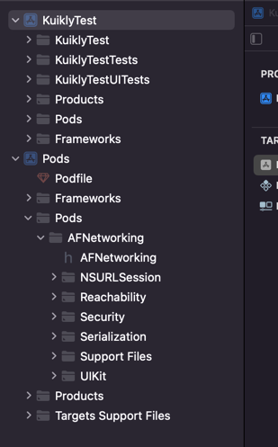

# iOS工程接入

:::tip 注意
在此之前请确保已经完成**KMP侧 Kuikly**的接入，如还未完成，请移步[KMP跨端工程接入](./common.md)
:::

完成**Kuikly KMP**侧的配置后, 我们还需要将**Kuikly**渲染器和适配器接入到宿主平台中，此文档适用于您想把Kuikly渲染器接入到您现有的iOS工程中。下面我们来看下，如何在现有iOS工程中接入Kuikly渲染器。

我们先新建一个名为**KuiklyTest**新工程并假设这个工程是你现有的iOS工程

<div align="center">

</div>

## 添加Kuikly iOS 渲染器依赖

### 方式一：通过 CocoaPods 集成（推荐）

1. 添加``kuikly ios render``, 在你的工程的podfile添加以下代码

```ruby{1,9}
source 'https://cdn.cocoapods.org/'

platform :ios, '14.1'

target 'KuiklyTest' do

inhibit_all_warnings!

pod 'OpenKuiklyIOSRender', 'KUIKLY_RENDER_VERSION'
end
```

:::tip 提示
* KUIKLY_RENDER_VERSION 需要替换为实际的 Kuikly 版本号，在这里[查看最新版本](../ChangeLog/changelog.md)
* 版本号需要和[KMP跨端工程](common.md)保持一致
:::

2. 执行``pod install --repo-update``安装依赖

---

### 方式二：通过 SPM（Swift Package Manager）集成

Kuikly iOS 渲染器已支持通过 SPM 集成，推荐 Xcode 12 及以上版本使用。

#### 1. 添加 Kuikly SPM 依赖

* 打开 Xcode，选择你的项目工程，点击左侧导航栏的 **Project**。
* 选择 **Package Dependencies** 标签页，点击右下角的 **+** 按钮。
* 在弹出的对话框中，输入 Kuikly iOS 渲染器的 Git 仓库地址：

  ```shell
  https://github.com/Tencent-TDS/KuiklyUI.git
  ```

* 选择你需要的版本（建议与 KMP 工程保持一致），点击 **Add Package**。
* 在弹出的选择框中，勾选你的 Target，点击 **Add Package** 完成依赖添加。

:::tip
如需指定版本号，请选择与 KMP 工程一致的版本号。
:::

#### 2. 链接 Kuikly 业务代码 framework

Kuikly 业务代码在 iOS 平台会被编译为 `.xcframework`，推荐以下集成方式：

* **推荐：通过 SPM 集成业务 `.xcframework`**  
  建议将业务 `shared.xcframework` 封装为一个本地或私有的 Swift Package，然后通过 SPM 集成到主工程。
  
  参考步骤如下：

  1. 新建一个 Swift Package（如 `shared`）,并将 `shared.xcframework` 拷贝到该包目录下。
  2. 在 `Package.swift` 中添加：

      ```swift
      .binaryTarget(
          name: "shared",
          path: "./shared.xcframework"
      )
      ```

  3. 在目标工程中通过 SPM 添加该 Package 依赖。
  4. 对于图片等资源文件，由于Kuikly默认从 `mainBundle`内按路径加载，因此有如下几种处理方式：

  * **方式一**：将图片资源文件直接拖动至工程中，由 Xcode 自动在打包时拷贝到 `main bundle` 内，注意需对齐Kuikly侧的使用方式，按需保留文件夹结构。

  * **方式二**：使用SPM管理资源，需如下两步：

    a. 准备资源package：修改上述或新建`Package.swift`，添加资源target，如下所示：

    ```swift
    .target(
        name: "SharedResource",
        resources: [
            // 注意使用.copy命令而非.process，以保留文件夹结构
            .copy("KuiklyResources") // KuiklyResources 为资源目录名，可任意命名
        ],
    ),
    ```

    将Kuikly项目所需的资源文件拷贝至上述KuiklyResources目录下，并适当增加include等必要目录结构以符合Swift Package要求。

    最终完整`Package.swift`应与如下示例类似：

    ```swift
    // swift-tools-version: 5.7
    import PackageDescription

    let package = Package(
        name: "shared",
        platforms: [.iOS(.v13)],
        products: [
            .library( name: "shared", targets: ["shared"]),
            .library(name: "SharedResource", targets: ["SharedResource"])
        ],
        targets: [
            .binaryTarget(
                name: "shared",
                path: "Frameworks/shared.xcframework",
            ),
            .target(
                name: "SharedResource",
                resources: [
                    .copy("KuiklyResources")
                ],
            ),
        ],
    )
    ```

    b. 修改工程接入设置，新增如下代理回调方法，返回资源加载目录：

    ```swift
    // MARK: - KuiklyViewBaseDelegate
    func resourceFolderUrl(forKuikly pageName: String) -> URL {
        return Bundle.main.bundleURL.appendingPathComponent("shared_SharedResource.bundle/KuiklyResources")
    }
    ```
  
  * **方式三**：自定义资源Swift Package, 并参考下文`实现图片加载适配器`一节进行自定义适配，注意确保路径正确匹配。
  
* **其他方式：**
  * **手动集成**：将 `shared.xcframework` 拖入 Xcode 工程，并设置为 `Embed & Sign`。

#### 3. 其他说明

* 适配器实现、Kuikly 容器等代码与 Pod 方式一致，参考下文实现即可。
* SPM 方式下，部分三方库（如 SDWebImage）如需使用，请自行通过 SPM 或 CocoaPods 集成。

---

## 实现Kuikly承载容器

在你现有的iOS工程中，新建KuiklyRenderViewController, 作为``Kuikly``页面的容器。

具体实现代码，请参考源码工程iOSApp模块的``KuiklyRenderViewController``类。

```objc
#import <UIKit/UIKit.h>
NS_ASSUME_NONNULL_BEGIN

@interface KuiklyRenderViewController : UIViewController

/*
 * @brief 创建实例对应的初始化方法.
 * @param pageName 页面名 （对应的值为kotlin侧页面注解 @Page("xxxx")中的xxx名）
 * @param params 页面对应的参数（kotlin侧可通过pageData.params获取）
 * @return 返回KuiklyRenderViewController实例
 */
- (instancetype)initWithPageName:(NSString *)pageName pageData:(NSDictionary *)pageData;
@end

NS_ASSUME_NONNULL_END
```

```objc
#import "KuiklyRenderViewController.h"
#import <OpenKuiklyIOSRender/KuiklyRenderViewControllerBaseDelegator.h>
#import <OpenKuiklyIOSRender/KuiklyRenderContextProtocol.h>

#define HRWeakSelf __weak typeof(self) weakSelf = self;
@interface KuiklyRenderViewController()<KuiklyRenderViewControllerBaseDelegatorDelegate>

@property (nonatomic, strong) KuiklyRenderViewControllerBaseDelegator *delegator;

@end

@implementation KuiklyRenderViewController {
    NSDictionary *_pageData;
}

- (instancetype)initWithPageName:(NSString *)pageName pageData:(NSDictionary *)pageData {
    if (self = [super init]) {
        // 存储页面数据
        pageData = [self p_mergeExtParamsWithOriditalParam:pageData];
        _pageData = pageData;
        // 实例化Kuikly委托者类
        _delegator = [[KuiklyRenderViewControllerDelegator alloc] initWithPageName:pageName pageData:pageData];
        _delegator.delegate = self;
    }
    return self;
}

- (void)viewDidLoad {
    [super viewDidLoad];
    self.view.backgroundColor = [UIColor whiteColor];
    // 通知Kuikly页面ViewDidLoad
    [_delegator viewDidLoadWithView:self.view];
    [self.navigationController setNavigationBarHidden:YES animated:NO];

}

- (void)viewDidLayoutSubviews {
    [super viewDidLayoutSubviews];
    // 通知Kuikly页面viewDidLayoutSubviews
    [_delegator viewDidLayoutSubviews];
}

- (void)viewWillAppear:(BOOL)animated {
    [super viewWillAppear:animated];
    // 通知Kuikly页面viewWillAppear
    [_delegator viewWillAppear];
    [self.navigationController setNavigationBarHidden:YES animated:NO];
}

- (void)viewDidAppear:(BOOL)animated {
    [super viewDidAppear:animated];
    // 通知Kuikly页面viewDidAppear
    [_delegator viewDidAppear];
    [self.navigationController setNavigationBarHidden:YES animated:NO];
}

- (void)viewWillDisappear:(BOOL)animated {
    [super viewWillDisappear:animated];
    // 通知Kuikly页面viewWillDisappear
    [_delegator viewWillDisappear];
}

- (void)viewDidDisappear:(BOOL)animated {
    [super viewDidDisappear:animated];
    // 通知Kuikly页面viewDidDisappear
    [_delegator viewDidDisappear];
}

#pragma mark - private

- (NSDictionary *)p_mergeExtParamsWithOriditalParam:(NSDictionary *)pageParam {
    NSMutableDictionary *mParam = [(pageParam ?: @{}) mutableCopy];
 
    return mParam;
}

#pragma mark - KuiklyRenderViewControllerDelegatorDelegate

// 创建等待加载视图
- (UIView *)createLoadingView {
    UIView *loadingView = [[UIView alloc] init];
    loadingView.backgroundColor = [UIColor whiteColor];
    return loadingView;
}

// 创建加载错误视图
- (UIView *)createErrorView {
    UIView *errorView = [[UIView alloc] init];
    errorView.backgroundColor = [UIColor whiteColor];
    return errorView;
}

// 设置业务代码编译成的framework名字
- (void)fetchContextCodeWithPageName:(NSString *)pageName resultCallback:(KuiklyContextCodeCallback)callback {
    if (callback) {
        // 返回对应framework名字
        callback(@"shared", nil);
    }
}

- (void)dealloc {
    [[NSNotificationCenter defaultCenter] removeObserver:self];
}


@end
```

## 实现Kuikly适配器（必须实现部分）

``Kuikly``框架为了灵活和可拓展性，通过适配器的设计模式，将一些功能的具体实现委托给宿主App实现。

``Kuikly``为iOS宿主工程提供了以下适配器

1. **图片加载适配器**: 用于给Kuikly的Image组件实现图片下载解码能力。**宿主侧必须实现**
2. **页面路由适配器**: 用于实现跳转到``Kuikly``容器。**宿主侧必须实现**
3. **日志适配器**: 用于给Kuikly框架和Kuikly业务实现日志打印。**推荐宿主侧实现**
4. **异常适配器**: 当Kuikly业务执行逻辑出错时，决定如何处理异常。**推荐宿主侧实现**
5. **颜色值转换适配器**: Kuikly框架对颜色值的处理，默认只处理十六进制的颜色值。**宿主按需实现**
6. **APNG图片加载适配器**: 用于给Kuikly提供APNG图片加载的能力。**宿主按需实现（使用APNG组件时必须实现）**

### 实现图片加载适配器

具体实现代码，请参考源码工程iOSApp模块的``KuiklyRenderComponentExpandHandler``类。

```objc
// .h
#import <Foundation/Foundation.h>
#import <OpenKuiklyIOSRender/KuiklyRenderBridge.h>

NS_ASSUME_NONNULL_BEGIN

/*
 * @brief 需要接入方自定义实现图片加载
 */
@interface KuiklyRenderComponentExpandHandler : NSObject<KuiklyRenderComponentExpandProtocol>


NS_ASSUME_NONNULL_END

@end
```

```objc
// .m
#import "KuiklyRenderComponentExpandHandler.h"
#import <SDWebImage/UIImageView+WebCache.h>

@implementation KuiklyRenderComponentExpandHandler

+ (void)load {
    // 注册自定义实现
    [KuiklyRenderBridge registerComponentExpandHandler:[self new]];
}

/*
 * 自定义实现设置图片
 * @param url 设置的图片url，如果url为nil，则是取消图片设置，需要view.image = nil
 * @return 是否处理该图片设置，返回值为YES，则交给该代理实现，否则sdk内部自己处理
 */
- (BOOL)hr_setImageWithUrl:(NSString *)url forImageView:(UIImageView *)imageView {
    // 图片下载我们使用
    [imageView sd_setImageWithURL:[NSURL URLWithString:url]];
    return YES;
}
/*
...

@end
```

### 实现页面路由适配器

具体实现代码，请参考源码工程iOSApp模块的``KRRouterHandler``类。

```objc
#import <Foundation/Foundation.h>
#import <OpenKuiklyIOSRender/KRRouterModule.h>
NS_ASSUME_NONNULL_BEGIN

@interface KRRouterHandler : NSObject<KRRouterProtocol>

@end

NS_ASSUME_NONNULL_END
```

```objc
#import "KRRouterHandler.h"
#import "KuiklyRenderViewController.h"

@implementation KRRouterHandler

// 注册适配器
+ (void)load {
    [KRRouterModule registerRouterHandler:[self new]];
}

// 打开页面
- (void)openPageWithName:(NSString *)pageName pageData:(NSDictionary *)pageData controller:(UIViewController *)controller {
    KuiklyRenderViewController *renderViewController = [[KuiklyRenderViewController alloc] initWithPageName:pageName pageData:pageData];
    [controller.navigationController pushViewController:renderViewController animated:YES];
}

// 关闭页面
- (void)closePage:(UIViewController *)controller {
    [controller.navigationController popViewControllerAnimated:YES];
}

@end
```

### 实现日志适配器
该适配器Kuikly有默认实现，非必须实现, 业务可根据实际使用需求来决定是否实现。
具体实现代码，请参考源码工程core-render-ios模块的``KuiklyLogHandler``类。
```objc
@interface KuiklyLogHandler : NSObject<KuiklyLogProtocol>

@end

@implementation KuiklyLogHandler

- (BOOL)asyncLogEnable {
    return NO;
}

- (void)logInfo:(NSString *)message {
    NSLog(@"%@", message);
}

- (void)logDebug:(NSString *)message {
#if DEBUG
    NSLog(@"%@", message);
#endif
}

- (void)logError:(NSString *)message {
    NSLog(@"%@", message);
}

@end
```

### 实现异常适配器
该适配器非必须实现, 业务可根据实际使用需求来决定是否实现。
如需实现，需重写`KuiklyRenderViewControllerBaseDelegatorDelegate`协议的`onUnhandledException:stack:mode:`方法，具体实现代码，请参考源码工程iOSApp模块的``KuiklyRenderViewController``类。

```objc
@implementation KuiklyRenderViewController

- (void)onUnhandledException:(NSString *)exReason stack:(NSString *)callstackStr mode:(KuiklyContextMode)mode
{
    // 处理异常或异常上报
}

@end
```

其他按需实现适配器示例参考[实现适配器（按需实现部分）](#实现适配器-按需实现部分)

## 链接Kuikly业务代码

Kuikly业务代码，在iOS平台上会被编译成``.framework``产物，下一步，我们将编译好的Kuikly业务代码``.framework``链接到你的工程。
``.framework``的集成，你可以选择远程pod接入或者本地pod接入。这里为了方便，我只演示本地pod接入。

我们先前在``Kuikly``[KMP跨端工程接入](common.md)中已经新建了``Kuikly``业务工程，然后我们将这个业务工程的业务代码编译成的``.framework``链接到我们的现有iOS工程

```ruby{10}
source 'https://cdn.cocoapods.org/'

platform :ios, '14.1'

target 'KuiklyTest' do

inhibit_all_warnings!

pod 'OpenKuiklyIOSRender', 'KUIKLY_RENDER_VERSION'
pod 'shared', :path => '/Users/XXX/workspace/TestKuikly/shared' # 本地存放Kuikly业务代码工程路径
end

```

重新执行``pod install``安装依赖

## 编写TestPage验证

1. 完成上述步骤后, 我们便完成了Kuikly的接入。下面我们在shared模块中编写TestPage，验证是否接入成功。我们在之前[KMP跨端工程接入](common.md)中新建的工程中的
``shared``模块中新建``TestPage``, 编写业务代码。新增的页面的名字为test

```kotlin
@Page("test")
class TestPage : Pager(){
    override fun body(): ViewBuilder {
        return {
            attr {
                allCenter()
            }

            Text {
                attr {
                    fontSize(18f)
                    text("Hello Kuikly")
                    color(Color.GREEN)
                }
            }
        }
    }
}
```

2. 接着我们初始化``KuiklyRenderViewController``，并将``test``作为``pageName``传入容器中, 指定跳转到我们刚新建的``TestPage``中

```objc
- (void)pushKRView {
    KuiklyRenderViewController *vc = [[KuiklyRenderViewController alloc] initWithPageName:@"test" pageData:nil];
        [self.navigationController pushViewController:vc animated:YES];
}
```

3. 当手机出现以下界面时, 说明接入已经成功接入Kuikly

<div align="center">

</div>

## 实现适配器（按需实现部分）
### 实现颜色值转换适配器

通过该适配器自定义颜色转换逻辑，业务可根据实际使用需求来决定是否实现
具体实现代码，请参考源码工程iOSApp模块的``KuiklyRenderComponentExpandHandler``类。

```objc
@implementation KuiklyRenderComponentExpandHandler
/*
 * 自定义实现设置颜色值
 * @param value 设置的颜色值
 * @return 完成自定义处理的颜色对象
 */
- (UIColor *)hr_colorWithValue:(NSString *)value {
    return nil;
}
```

### 实现APNG图片加载适配器

通过该适配器加载并显示APNG图片，当业务需要使用APNG组件时必须实现该适配器
具体实现代码，请参考源码工程iOSApp模块的``KRAPNGViewHandler``类。

```objc
@interface KRAPNGViewHandler : SDAnimatedImageView<APNGImageViewProtocol>

@end

@implementation KRAPNGViewHandler

+ (void)load {
    [KRAPNGView registerAPNGViewCreator:^id<APNGImageViewProtocol> _Nonnull(CGRect frame) {
        KRAPNGViewHandler *apngView = [[KRAPNGViewHandler alloc] initWithFrame:frame];
        return apngView;
    }];
}

@end
```
