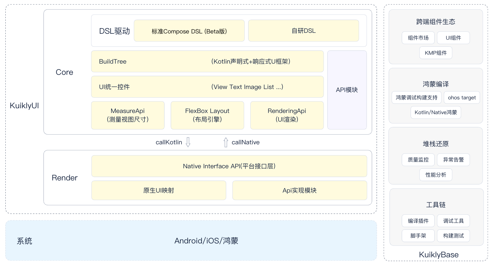

# 概述

在接入之前，我们先回顾一下``Kuikly``的总体架构图。

从上图来看，``Kuikly``框架分为两部分:

1. ``KuiklyCore``: 基于**KMP构建的跨平台声明式+响应式实现, 并且抽象了一套统一的UI控件**。接着编译期，会使用**KMP编译器**将``KuiklyCore`` + ``Kuikly``业务代码编译成各个平台的执行产物，例如在Android上是``.aar``, iOS上是``.framework``,鸿蒙上是``.so``
2. ``KuiklyRender``: ``KuiklyCore``本身不具有UI渲染能力，它只声明了UI控件的统一接口, 具体的渲染实现是由``KuiklyRender``负责的。

基于此，``Kuikly``的接入包含``KMP``侧接入``KuiklyCore``和平台侧接入``KuiklyRender``的工作。

``KMP``侧接入是跨平台的，业务只需要接入一次(无需各个平台都接入)，而**平台侧**的接入需要各个各个平台分别接入。下面是接入事项的主要工作:

1. **KMP跨端工程接入KuiklyCore**:
   1. 新建``KMP``业务工程，并添加``Kuikly``相关的依赖。
   2. 在KMP工程开始编写业务代码
2. **平台侧KuiklyRender**:
   1. 添加``Kuikly``在平台的渲染器依赖
   2. 实现``Kuikly``在各个平台的适配器
   3. 将``Kuikly``视图嵌入到平台的页面容器(Android为Fragment或者Activity, iOS为ViewController, 鸿蒙为ArkTS组件)

## 下一步

* 如果你是负责**KMP侧**跨平台``KuiklyCore``的接入的话，您可以移步[KMP跨端工程接入](common.md)查看如何接入``KuiklyCore``
* 如果你是负责平台侧``KuiklyRender``接入, 您可以移步[Android KuiklyRender接入](android.md), [iOS KuiklyRender接入](iOS.md), [鸿蒙 KuiklyRender接入](harmony.md)